# Benchmark Sorts: Bubble Sort vs Quick Sort

## Author

**Irving F. Sanchez**  
Lewis University  
Course: SP25-CPSC-34000-002 (Algorithms and Data Structures)

## Overview

This Python project benchmarks two classic sorting algorithms—**Bubble Sort** and **Quick Sort**—on real-world datasets of varying sizes. It allows users to select a dataset, choose the attribute to sort, and view the timing results for five runs on a graph with color-coded annotations and average performance lines.

This project is intentionally written to be clear, readable, and educational.

## Metaphor

The sorting algorithms are framed as tournament judges:

- 🟥 **Bubble Sort**: The slow but diligent judge who compares every entry manually.
- 🟩 **Quick Sort**: The efficient strategist who divides and conquers with smart pivots.

## Features

- **User-selectable datasets**:
  - `Pokemon.csv` (~1,000 rows)
  - `tokens.csv` (~5,000 rows)
  - `games.csv` (~10,000 rows)
- **Choose sorting attribute per dataset**:
  - **Pokémon**: `Name`, `Total`, or `HP`
  - **MTG Tokens**: `artist`, `name`, or `colorIdentity`
  - **Video Games**: `title`, `rating`, or `userscore`
- **Dataset configuration**:
  - Randomized order
  - Almost sorted (sorted with 5% of entries swapped)
- **Timed execution** of both sorts (5 runs each)
- **Export sorted data**:
  - Save results to descriptive files (e.g., `Pokemon_Name_sorted_data.txt`) 'I do this to visually show that the data was actually sorted.'
- **Interactive line graph**:
  - Color-coded run values (🟥 Bubble Sort, 🟩 Quick Sort)
  - Dashed average lines for both algorithms
  - Annotated time values for each run
  - Clear labels and legends

## How to Run

## Virtual Environment Setup (Recommended)

To prevent conflicts with your system Python environment, it's recommended to run this project in a virtual environment.

### 1. Create a virtual environment

```bash
python -m venv benchmark-env
```

### 2. Activate the virtual environment

- On Windows:

    ```bash
    benchmark-env\Scripts\activate
    ```

- On macOS/Linux:

    ```bash
    source benchmark-env/bin/activate
    ```

### 3. Install the required libraries

```bash
pip install pandas matplotlib
```

### 4. Run the program

```bash
python sorting-benchmark.py
```

### 5. Deactivate the environment when you're done

```bash
deactivate
```

## File Structure

- `sorting-benchmark.py` — Main program logic
- `Pokemon.csv`, `tokens.csv`, `games.csv` — Data sources
- Graph is displayed interactively using `matplotlib`

```mermaid
flowchart TD
    Start([Start])
    Menu[Display menu]
    Pokemon[Pokémon]
    Games[Video Games]
    Tokens[Tokens]

    AttrChoice[Attribute choice?]
    TypeChoice[Dataset type?]
    Benchmarks1[Run sorting benchmarks]
    Benchmarks2[Run sorting benchmarks]


    Graph1[Display graph]
    Graph2[Display graph]
    GraphFinal([End])

    Start --> Menu
    Menu --> Pokemon
    Menu --> Games
    Menu --> Tokens

    Pokemon --> AttrChoice
    Games --> AttrChoice
    Tokens --> AttrChoice

    AttrChoice --> TypeChoice
    TypeChoice --> Benchmarks1
    TypeChoice --> Benchmarks2

    Benchmarks1 --> Graph1
    Benchmarks2 --> Graph2

    Graph1 --> GraphFinal
    Graph2 --> GraphFinal
```



## Educational Goals

- Demonstrate the practical differences between O(n²) and O(n log n)
- Provide visual insight into sorting performance
- Encourage learners to explore, adjust parameters, and experiment
- Promote coding clarity and metaphor-based teaching

## References

- GeeksforGeeks. (n.d.). *Bubble Sort*. <https://www.geeksforgeeks.org/bubble-sort/>
- GeeksforGeeks. (n.d.). *Quick Sort*. <https://www.geeksforgeeks.org/quick-sort/>
- Kindson The Genius. (2017). *Sorting Algorithms Explained* [Video]. YouTube. <https://www.youtube.com/@KindsonTheGenius>
- Python Software Foundation. (n.d.). *time — Time access and conversions*. <https://docs.python.org/3/library/time.html>
- Matplotlib Developers. (n.d.). *Matplotlib documentation*. <https://matplotlib.org/stable/contents.html>
- Kaggle. (n.d.). *Pokemon, Video Game, MTG* [Dataset]. <https://www.kaggle.com/datasets/...>

## License

This project is licensed under the [MIT License](LICENSE).
