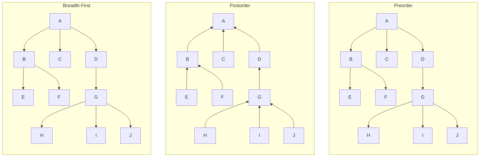

# Tree Abstract Data Type (ADT) Implementation

## Overview

[Tree Data Structures - GeeksforGeeks](https://www.geeksforgeeks.org/generic-treesn-array-trees/)  
[Why Trees Matter - MIT OpenCourseWare](https://ocw.mit.edu/courses/electrical-engineering-and-computer-science/6-006-introduction-to-algorithms-fall-2011/lecture-videos/lecture-4-heaps-and-heap-sort/)  

The following Python file (forest_manager.py) demonstrates a general tree structure with multiple traversal methods. Furthermore, this tree structure uses custom TreeNode and Tree classes with metaphorical botanical naming conventions for clarity. I always find programming or anything within the field of math and science easier to understand when you simplify the contents into segments that paint a picture rather than using the traditional jargan that may seem overwhelming or confusing to some.

One of my goals in the future is to create a cirruculum that makes programming/math/science accessible to everybody which is part of the reason you'll see so many notes in my code. The notes are primarily for me but it allows me to reflect back on my code and think of ways I can simplify the learning process for myself and others. I like to think both short-term and long-term.

So with that being said, let us begin.

## Table of Contents

- [Tree Abstract Data Type (ADT) Implementation](#tree-abstract-data-type-adt-implementation)
  - [Overview](#overview)
  - [Table of Contents](#table-of-contents)
  - [Class Structure](#class-structure)
    - [TreeNode Class](#treenode-class)
    - [TreeGrove Class](#treegrove-class)
  - [Traversal Algorithms](#traversal-algorithms)
  - [Tree Construction](#tree-construction)
  - [Visual Representation](#visual-representation)
    - [Preorder Traversal Flow (Root → Children)](#preorder-traversal-flow-root--children)
  - [Usage Example](#usage-example)

## Class Structure

### TreeNode Class

[Tree Nodes Explained - Princeton CS](https://algs4.cs.princeton.edu/32bst/)  

(The Family Tree) The class structure for TreeNode is important since it's primary function is storing. You can see this implemented through payload, which is the actual data--critical for any ADT. In order to enable upward traversal we use parent_branch which is later used in postorder. Lastly, in TreeNode we use child_branches to enable hierarchical relationships (core of the trees).

```python
class TreeNode:
    def __init__(self, payload):
        self.payload = payload      # Data storage
        self.parent_branch = None   # Reference to parent node
        self.child_branches = []    # List of child nodes

    def graft_child(self, new_sapling):
        """Adds a child node"""
        new_sapling.parent_branch = self
        self.child_branches.append(new_sapling)

    def is_leaf_node(self):
        """Checks if node has no children"""
        return len(self.child_branches) == 0
```

The line, def graft_child(self, new_sapling): is a method that allows you to attach a new TreeNode instance (new_sapling) as a child of the current node. This is achieved through two steps. First, by setting the parent--the line new_sapling.parent_branch = self establishes self (the current node) as the parent of new_sapling. Particularly important because it maintains the hiearchical structure of the tree, ensuring each node knows its parent.

The line self.child_branches.append(new_sapling) adds new_sapling to the list of child nodes maintained by the current node (self). This grows as the tree structure downwards (towards the root).

Imagine each TreeNode as a person in a family (The Family Tree), payload is their name (such as Grandma Elena), parent_branch is their parents (Great-Grandma Jenny), and child_branches is the children (["Uncle Henry, "Aunt Carolina"]). Like within a family, you need to know who someone's parents and children are to map relationships. Without these links, you'd essentially have orphans floating around with no connection.

### TreeGrove Class

(The Town Hall) The TreeGrove is like a town hall that keeps records of all the families. If we take a look at root_arbor this is the town founder ("Founder Michaelangelo") metaphorically speaking and hypothetically. The traversal methods are essentially different ways we can vist every family.

```python
class TreeGrove:
    def __init__(self, root_arbor):
        self.root_arbor = root_arbor  # Root node reference

    def explore_preorder(self, current_arbor):
        """Root → Children traversal"""
    
    def explore_postorder(self, current_arbor):
        """Children → Root traversal"""
    
    def explore_breadth_first(self):
        """Level-by-level traversal"""
```

Preorder is like meeting the parents before their kids (similar to a family reunion wheere adults chat first). Postorder is like talking to the kids before parents (like the kids giving presentations before the adults talk amongst each other). Breadth-first is like visiting generation by generation (similar to a census taker going house-to-house). The town hall doesn't give a flip what the families discuss but moreso how to visit each family in a systematical manner.

## Traversal Algorithms

[Traversal-Algorithms](https://www.khanacademy.org/computing/computer-science/algorithms)

| Method | Order | Example Output |
|--------|-------|----------------|
| `explore_preorder()` | Root → Children | A, B, E, F, C, D, G, H, I, J |
| `explore_postorder()` | Children → Root | E, F, B, C, H, I, J, G, D, A |
| `explore_breadth_first()` | Level Order | A, B, C, D, E, F, G, H, I, J |

## Tree Construction

The sample tree is built to match this exact structure:

```markdown
        [A]
      /  |  \
    [B] [C] [D]
    / \     |
  [E][F]   [G]
        / | \
      [H][I][J]
```

Construction code:

```python
def cultivate_sample_tree():
    mighty_oak = TreeNode("A")
    # ... (all node creations from the forest_manager.py)
    mighty_oak.graft_child(birch)  # A → B
    birch.graft_child(elm)         # B → E
    # ... (all relationships in the actual code)
    return TreeGrove(mighty_oak)
```

## Visual Representation

### Preorder Traversal Flow (Root → Children)



## Usage Example

```python
# Build and traverse the tree
arboretum = cultivate_sample_tree()

print("Preorder:")
arboretum.explore_preorder(arboretum.root_arbor)

print("\nPostorder:")
arboretum.explore_postorder(arboretum.root_arbor)

print("\nBreadth-First:")
arboretum.explore_breadth_first()
```
